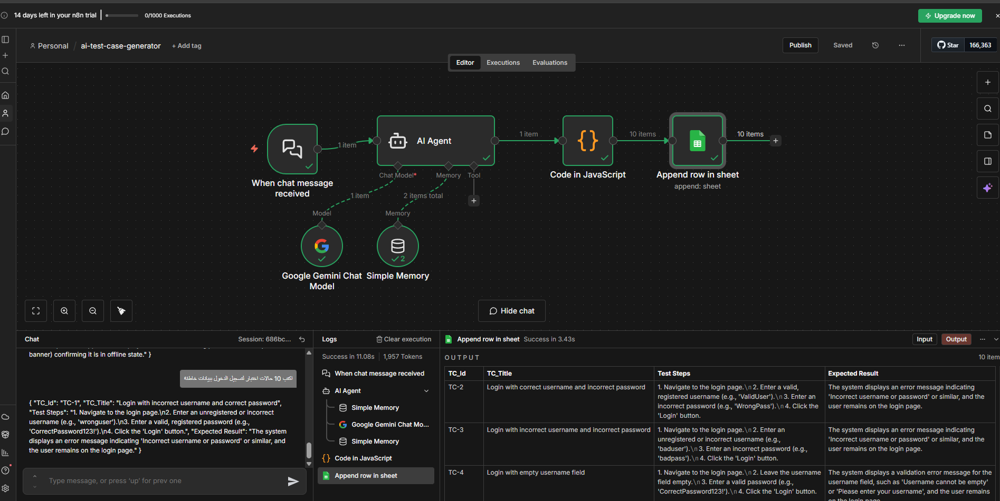

# ai-test-case-generator-n8n

AI-powered test case generator built using **n8n** and **Google Gemini**.

The workflow accepts **Arabic instructions** from the user and automatically generates **structured test cases in English**, then saves them directly to **Google Sheets**.

---

## 🚀 Features
- Write instructions in Arabic
- Specify the number of test cases
- Automatically generate:
  - Test Case ID
  - Title
  - Test Steps
  - Expected Result
- Export test cases to Google Sheets
- Fully automated using n8n

---

## 🧠 How It Works
1. User sends instructions in Arabic via chat
2. AI Agent (Google Gemini) understands the request
3. Test cases are generated in structured JSON
4. Data is parsed and written to Google Sheets

---

## 🧩 n8n Workflow

---

## 📊 Generated Test Cases (Google Sheets)

---

## 📁 Project Files
- `ai-test-case-generator.json` → n8n workflow export
- `screenshots/` → project screenshots
- `README.md` → documentation

---

## 🛠 Tools & Technologies
- n8n
- Google Gemini
- Google Sheets
- JavaScript (n8n Code node)

---

## 👨‍💻 Author
**Ali Essam**  
QC Engineer
